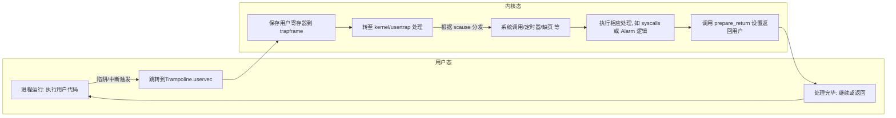
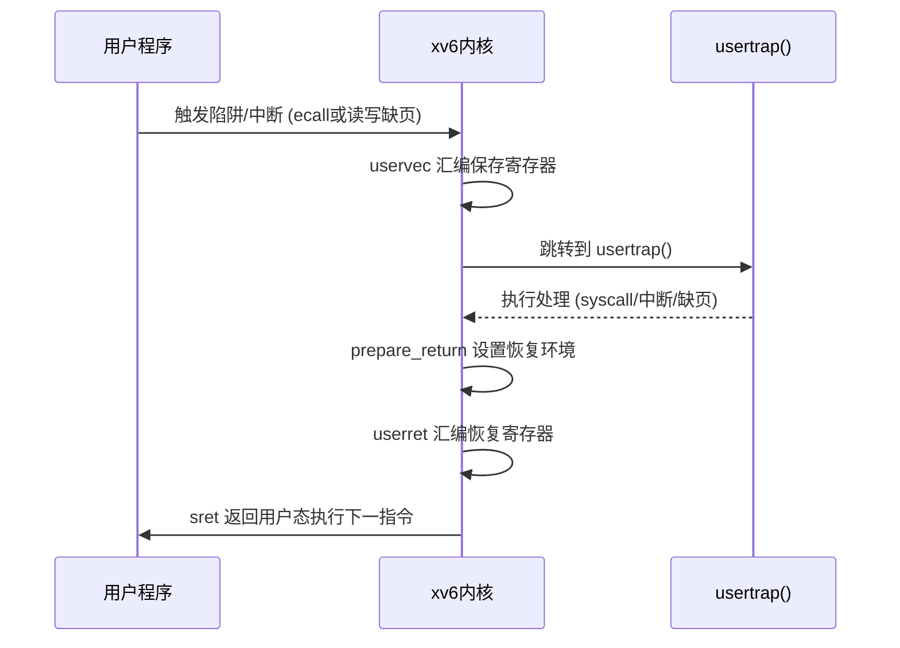

# 执行摘要  
本报告围绕在 xv6-riscv 上实现以下四大功能：**用户级陷阱处理**、**缺页陷阱（懒分配、写时复制 COW、简易 mmap）**、**多线程支持**和**E1000 网卡驱动及四层协议栈**。针对每项功能，介绍背景与目标，说明关键原理与实现要点，列出相关源代码文件/函数/数据结构，给出伪代码或重要代码片段，并讨论调试与测试方法。为便于面试讲解，每项内容后附面试问答要点，并列出学习资源。报告采用清晰条理、可演示的风格，并通过表格与 **Mermaid** 图示流程与关系。

# 1. 用户级陷阱处理  
**背景与目的：** xv6 默认在用户态遇到系统调用或中断时进入内核处理，之后恢复用户执行。用户级陷阱处理是指在用户进程内部设立“用户态中断/故障处理函数”（类似 Linux 信号机制），让用户进程能自行安装的函数在特定事件（如定时器、页面缺失等）触发时被调用。实现思路参考 MIT 6.S081 的 Alarm 实验。

**关键原理与实现要点：**  
- **陷阱转移过程：** 利用 RISC-V 的 trampolines 機制。CPU 从用户态触发陷阱后，跳转到位于**trampoline 页**的 `uservec` 入口（由内核在用户页表中映射，无用户权限），该汇编代码将用户上下文寄存器存入进程的 **trapframe**（一个在用户页表中映射的内核内存页），然后跳转到内核的 `usertrap()` 函数。`usertrap()` 根据 `scause`（陷阱原因）进行分发：`scause==8` 为系统调用（调用 `syscall()`），其它为中断或异常（调用 `devintr()` 判断设备中断，或处理缺页）。完成处理后调用 `prepare_return()` 设置返回用户态的寄存器（包括将 `stvec` 改为跳回 `uservec`，以及将用户 PC 存于 `sepc`）。最后，trampoline 的 `userret` 从 `trapframe` 恢复用户寄存器，并执行 `sret` 返回用户态。  
- **trapframe 映射与安全性：** 内核为每个进程分配一个物理页作为 `trapframe`（在 `allocproc()` 中用 `kalloc()`），并在用户页表中固定映射到虚拟地址 `TRAPFRAME` (trampoline 页正下方)。映射标志为 `PTE_R|PTE_W`（无 `PTE_U`），因此**用户态不可访问该页**（仅超级用户态的 trampoline 代码可读写），保证用户程序无法篡改内核保存的上下文。内核通过 `p->trapframe` 指针访问，trampoline 汇编则假定 `TRAPFRAME` 是该结构在用户地址空间的虚拟基址。

- **用户定时中断（Alarm）处理：** 按照 MIT 实验，新增 `sigalarm(int ticks, void (*handler)())` 和 `sigreturn()` 系统调用，以及在 `struct proc` 中添加字段：`int ticks; int cur_ticks; uint64 handler; struct trapframe *alarm_tf; int alarm_on;`。`sys_sigalarm` 保存用户指定的 `ticks` 和 `handler`。在 `usertrap()` 中，当 `devintr()` 识别到时钟中断 (which_dev==2) 且进程未在处理先前警报时，内核：  
  - 将当前 `proc->trapframe` 内容复制备份到新分配的内存 `alarm_tf`；设置 `alarm_on=1`；将 `cur_ticks++`；如果达到了触发阈值 (`cur_ticks>=ticks`)，则修改 `p->trapframe->epc = handler`（即**修改返回用户态时的下一条指令为处理函数起始地址**），然后返回。此时用户态将在该地址开始执行。  
  - 处理函数执行完毕后，用户需调用 `sigreturn()`，内核在其对应的系统调用 `sys_sigreturn` 中恢复 `p->trapframe`（`memmove` 回原来的 `alarm_tf`），释放备份，重置 `alarm_on=0, cur_ticks=0`。如此可保证处理函数执行后用户进程从中断点恢复。  
- **系统调用和用户接口：** 在 `user/user.h` 中声明原型 `int sigalarm(int ticks, void (*handler)()); int sigreturn(void);`，在 `kernel/syscall.h`、`kernel/syscall.c` 及 `user/usys.pl` 中增加对应条目。`sys_sigalarm` 使用 `argint`/`argaddr` 取参数，并将值写入当前进程结构体；`sys_sigreturn` 恢复上下文。编译和调用时需注意内核和用户空间的交互规则。

**相关 xv6 代码位置：**  
- **trap 处理：** `kernel/trap.c` 中的 `usertrap()`、`kerneltrap()`、`prepare_return()`；汇编在 `kernel/trampoline.S` 的 `uservec` 和 `userret`。  
- **进程结构：** `kernel/proc.h` 的 `struct trapframe`（定义寄存器保存布局）及 `struct proc`（`trapframe` 指针和新增 alarm 字段）。  
- **系统调用：** `kernel/sysproc.c` (`sys_sigalarm`、`sys_sigreturn`)、`kernel/syscall.h`/`kernel/syscall.c`、`user/user.h`/`user/usys.pl`。  
- **用户态接口示例：** MIT 提供 `user/alarmtest.c` 和汇编版 `alarmtest.asm`。  

**关键代码示例：**  
```c
// kernel/trap.c 中 usertrap 处理时钟中断片段（伪代码）：
if ((which_dev = devintr()) == 2) { // 定时器中断
  if (!p->alarm_on) {
    // 进入信号处理
    p->alarm_on = 1;
    struct trapframe *backup = kalloc();
    memmove(backup, p->trapframe, sizeof(*backup));
    p->alarm_tf = backup;
    p->cur_ticks++;
    if (p->cur_ticks >= p->ticks) {
      p->trapframe->epc = p->handler; // 设定下次用户恢复至 handler
    }
  }
}
```
```c
// kernel/sysproc.c: sigalarm 系统调用
uint64 sys_sigalarm(void) {
  int ticks;
  uint64 handler;
  argint(0, &ticks);
  argaddr(1, &handler);
  struct proc *p = myproc();
  p->ticks = ticks;
  p->handler = handler;
  return 0;
}
// kernel/sysproc.c: sigreturn 系统调用
uint64 sys_sigreturn(void) {
  struct proc *p = myproc();
  memmove(p->trapframe, p->alarm_tf, sizeof(*p->alarm_tf));
  kfree(p->alarm_tf);
  p->alarm_tf = 0;
  p->alarm_on = 0;
  p->cur_ticks = 0;
  return 0;
}
```

**调试与测试：**  
- **编译与运行：** 使用 MIT 指定的 `alarmtest.c`，更新 Makefile 包含该程序；在 QEMU 中运行 `alarmtest` 及 `usertests`，观察输出是否通过测试。可用 `make CPUS=1 qemu-gdb` 进行单步调试跟踪陷阱入口。  
- **常见错误：** 
  - 忘记保存/恢复必要寄存器，导致回到用户态后执行流程错乱。 
  - 在**未设置 `alarm_on`** 标志的情况下多次触发，导致重复调用。 
  - 未正确恢复 trapframe 导致原用户现场丢失。 
  - 系统调用注册遗漏。  
- **定位方法：** 可在 `usertrap()` 增加打印跟踪 `scause`、`sepc`；查看 `ps -l`、使用 GDB 断点检查 `trapframe` 内容。使用 `tcpdump` 或 `nettest`（下一节）时钟也可见中断触发。  

**面试问答要点：**  
- Q: 什么是用户级陷阱处理？A: 在用户进程中安装的“软件中断”处理程序，例如定时器到期后调用预设的用户函数。。  
- Q: xv6 中寄存器在用户态陷阱时如何保存？A: `trampoline.S` 的 `uservec` 将用户寄存器存入 `struct trapframe`（映射到用户地址空间）。  
- Q: trapframe 在哪映射，用户能否访问？A: 在每进程用户页表的固定地址 `TRAPFRAME` 处映射（仅内核权限，PTE_U=0），用户态不可读写。  
- Q: 实现 `sigalarm` 时需要修改哪些 xv6 部分？A: `struct proc` 增加字段、`trap.c` 的 `usertrap()` 逻辑、`sysproc.c` 新增 syscall、用户库头文件与 `usys.pl` 增加接口。  

# 2. 缺页陷阱：懒分配、写时复制(COW)、简易 mmap  
**背景与目的：** 操作系统通过页表拦截访问，支持将地址**按需分配或共享**。**懒分配**（Lazy Allocation）是指 `sbrk()` 增长虚拟地址空间但不立即分配物理页，待第一次访问该页时才分配，提高大内存请求效率。**写时复制（COW）**优化了 `fork()`：父子进程初始共享只读页面，只有写时才复制页面，减少开销。**简易 mmap** 则将文件或匿名内存映射到用户空间，可结合懒分配实现。  

**关键原理与实现要点：**  
- **懒分配实现：** 修改 `sys_sbrk()`（`kernel/sysproc.c`）取消立即分配：仅增加 `p->sz += n` 而不调用 `uvmalloc()`。在 `usertrap()` 中处理用户态缺页异常：检测到 `scause` 为 Load/Store Fault (13 或 15) 并且缺页地址 `r_stval()` 在 `p->sz` 范围内（大于旧 `sz` 且未分配）时，调用 `kalloc()` 分配页面、`memset` 清零，再用 `mappages()` 将该页面映射到故障地址。若地址超出已分配区，则置 `p->killed=1`。还要修改 `uvmunmap()` 以忽略未映射页的取消映射请求，避免 panic。  
- 
- **COW Fork 实现：** 对应 MIT COW 实验。在 `uvmcopy()`（`kernel/vm.c`）中让子进程继承父的物理页面：不 `kalloc()` 新页，而是将父的 PTE 复制到子页表，并**清除两者的写权限** (`PTE_W=0`)，可额外在 PTE 的软件保留位（RSW）标记为 COW 映射。为跟踪引用数量，在每个物理页上维护**引用计数**（如用固定数组，索引 = PA/4096）。`fork()` 后父子各自指向相同页面，refcount++。  
  在 `usertrap()` 或底层 `vmfault()` 处理缺页时：检测到 **写访问缺页** 且该页被标为 COW（或原本可写的页面写时被置只读），则执行 COW：`kalloc()` 新页，`memmove()` 旧页数据，新页用 `mappages()` 映射到该虚拟地址并设 `PTE_W`，同时父进程的 PTE 保持原始（继续只读）。将故障进程的 refcount 减 1。若请求写的页面原本本来就是只读（例如文本段），则直接 kill 进程。  
  释放时，当任何进程从页表移除一个页面（如 `uvmunmap`），相应物理页的 refcount--，refcount 为 0 时再 `kfree()` 回收。可以在 `kfree()` 中判断 refcount。  
- **copyout/copyin 注意：** 系统调用（如 `read/write`）在内核 copy 数据到用户空间时，也可能遇到尚未映射的懒分配页或 COW 写页。为处理此情况，可修改 `copyout()`：在其遇到用户地址映射无效时触发与缺页异常相同的逻辑，即延迟分配或进行 COW，处理后再重试拷贝。或者在 `walkaddr()`（翻译地址到物理）中检测，迫使内核调用 `vm_fault`。此举可保证用户调用接口时不再错误。  

**简易 mmap：** 实现思路同懒分配：增加 `sys_mmap(addr, len, prot)` 或简化版；在内核仅记录映射区而不立即分配页（可借助 `p->sz` 或自定义数据结构管理映射区域）。缺页时在上述用户缺页处理逻辑中判断该地址属于 mmap 区域，执行物理页分配映射。细节可按项目需求简化：例如只支持匿名映射或按页映射文件内容。  

**相关 xv6 代码位置：**  
- **虚拟内存管理：** `kernel/sysproc.c` 的 `sys_sbrk` (删除原来的 `growproc` 调用)；`kernel/vm.c` 包括 `uvmalloc`、`uvmcopy`、`uvmunmap` 等，COW 需改写 `uvmcopy`（不分配新页，清写权限）。  
- **陷阱处理：** `kernel/trap.c` 中的 `usertrap()` 或其调用的 `vmfault()`；在其中新增页分配逻辑。MIT 示例建议在页错误打印之前插入处理代码。  
- **引用计数：** 在 `kernel/kalloc.c` 新增全局数组 `refcount[]`，并在 `kalloc()/kfree()` 或 `fork/exit` 中维护。PTE 的软件位（PTE_COW）也可以在 `riscv.h` 定义并使用。  
- **copyout：** 在 `kernel/proc.c` 或 `kernel/sysfile.c` 的 `copyout()`, `copyin()` 处加入检测：如果遇到缺页可触发前述缺页机制（用户态缺页即会进入 `usertrap`）。  
- **系统调用：** 如新增 `sys_mmap`、`sys_munmap` 时需在 syscall 表注册并在用户头文件声明。  

**关键代码示例：**  
```c
// kernel/sysproc.c: 修改后的 sbrk
uint64 sys_sbrk(void) {
  int n;
  argint(0, &n);
  struct proc *p = myproc();
  int oldsz = p->sz;
  // 仅修改 sz，不立即分配物理页
  if (n > 0) p->sz += n;
  else if (n < 0) { if (growproc(n) < 0) return -1; }
  return oldsz;
}
// kernel/trap.c: 在 usertrap 中处理缺页（伪代码）
uint64 va = r_stval();
if ((r_scause() == 13 || r_scause() == 15) && va >= 0) {
  uint64 pa;
  va = PGROUNDDOWN(va);
  struct proc *p = myproc();
  if (va < p->sz) {
    // 懒分配：分配新物理页映射到 va
    char *mem = kalloc();
    if (!mem) { setkilled(p); }
    else {
      memset(mem, 0, PGSIZE);
      mappages(p->pagetable, va, PGSIZE, (uint64)mem,
               PTE_R|PTE_W|PTE_X|PTE_U);
    }
    // 返回用户继续执行
    return; 
  }
}
// 如果不是懒分配情形，或 COW 逻辑，则进入其他处理
```

**调试与测试：**  
- **测试用例：** 运行官方提供的 `lazytests` 和 `cowtest`（见 MIT lab），以及 `usertests`。测试常见场景，如跨越已分配边界的缺页、COW 情况、二次 fork、exec 覆盖等。  
- **常见错误：** 
  - `uvmcopy` 未考虑懒页，导致子进程访问父进程未映射页时报错。解决：在 `uvmcopy` 中对父页表不存在的页忽略即可。  
  - COW 忘记清除 `PTE_W`，或者未维护引用计数，导致双重释放或页面泄露。  
  - 未在 `copyout()` 中处理缺页，导致用户的 `read/printf` 等在未分配地址出错。  
  - 懒分配时未处理负 `sbrk` 和栈下界（如栈下保护页溢出）。可参考提示：负值调用仍使用 `growproc()`；超出范围的访问直接杀死进程。  
- **定位方法：** 
  - 在 QEMU 上单步运行导致缺页的用户程序，观察 `usertrap()` 打印信息。 
  - 打印 `p->sz` 与触发地址、`pagetable` 状态（可用自制 `vmprint`）。 
  - 检查页表标志（PTE_W, PTE_U, 资源位）是否按预期设置。 
  - 使用 `git bisect` 找到首次破坏的提交。  

**面试问答要点：**  
- Q: 为什么需要懒分配？A: 避免一次性给大内存请求分配大量物理页，提升效率并支持稀疏使用。  
- Q: 懒分配在 xv6 中如何检测并处理缺页？A: 在 `usertrap()` 检测到缺页异常且地址在 `p->sz` 范围内，则调用 `kalloc()` + `mappages()` 动态分配映射。  
- Q: COW fork 的基本思路是什么？A: 父子共享原物理页，将其标为只读；任何写操作触发页故障后内核复制页帧并更新页表。  
- Q: PTE 中有什么位用来实现 COW？A: 可以使用 RISC-V 页表的**保留位**（RSW）标记 “写时复制”页面，或直接通过清除写权限并记录逻辑。  
- Q: 简易 `mmap` 与 `sbrk` 懒分配有什么不同？A: `mmap` 通常映射文件或匿名区，可先标记虚拟区间不分配，到用户访问时分配物理页；与懒分配类似，只是地址来源不同。  

# 3. 线程调度  
**背景与目的：** 线程（Thread）是轻量级并发单位，多个线程**共享同一进程地址空间**，通过在用户或内核调度来实现并行执行。相较于多个进程，线程切换开销更小，共享内存易于通信。为支持多线程，需要实现线程创建/退出/同步等功能。MIT 以及 OSTEP 等教材提出了在 xv6 中实现内核线程（`clone`/`join`）以及用户线程库。

**关键原理与实现要点：**  
- **线程数据结构：** 通常复用 xv6 的 `struct proc`。每个线程用一个 `proc` 结构代表，但同属一个进程（共享页表）。可在 `struct proc` 中新增标记（如 `is_thread`、`parent_thread`），或者通过父子关系记录同属一组线程。**共享地址空间**：线程不应复制页表，而是让新的 `proc->pagetable` 指向与创建者相同的页表指针，或者在 fork/clone 时增加页表引用计数。  
- **`clone()` 系统调用：** 原型如 `int clone(void (*fn)(void*), void *arg)`。实现时：  
  1. 调用 `allocproc()` 新建 `proc` 结构 `nt`，但不同于 fork 要 **共享父进程的页表**（因此不调用 `uvmcopy()`，直接让 `nt->pagetable = parent->pagetable`，并对引用计数加一）。  
  2. **分配栈**：用户线程需要自己的栈页，通常在原进程的栈下方申请一个页（如在 `p->sz` 附近保留空间），并将返回值寄存器 `ra` 设置为一个虚拟地址（如 0xffffffff）让线程函数退出后能调用 `exit()`。在 `nt->trapframe` 中修改寄存器，使之在启动时从 `fn(arg)` 执行。  
  3. 文件描述符、当前目录等继承与 fork 相同（每线程独立引用）。  
  4. 调用 `release(&nt->lock)` 使新线程可运行。返回新线程 pid 给父。  
- **线程退出与 `join()`：** 线程函数结束时调用 `exit()`。实现细节：如果是线程，`exit()` 不应立即销毁整个地址空间，只应将线程状态变为 ZOMBIE、唤醒在 `join` 上等待的线程。`join()` 在父线程中调用，与 `wait()` 类似，只等待**同一地址空间**下子线程结束：遍历 proc 表查找子线程（共享页表的子进程）并处于 ZOMBIE，则回收资源（释放线程栈、proc 结构），返回其 pid；若没有就睡眠，直到一个子线程唤醒父。  
- **内核同步：** 在多线程场景下，线程间调度与阻塞需要同步原语：  
  - 可以使用现有的 **spinlock**（如 `proc` 自带的 `p->lock` 或自定义全局锁）来保护共享结构，如线程列表、`join` 操作。  
  - **阻塞队列：** `sleep(chan, &lock)`/`wakeup(chan)` 可用于实现 `join()` 等阻塞操作：父线程在 `join()` 时对线程组的等待情况 `sleep` 在某个信道上；子线程 `exit()` 时通过 `wakeup` 叫醒父。  
- **线程调度：** xv6 默认调度器（`kernel/sched.c`）会把所有 RUNNABLE 的 `proc`（包括线程和进程）当作可执行单位。线程创建后应将状态置为 RUNNABLE，调度器即可选中执行。因为线程共享页表，必须保证在切换时不误切换页表，内核调度时只切换内核栈与上下文，用户态依然执行各自的栈帧。  
- **用户线程库（选做）：** 也可以在用户空间实现绿色线程库，修改如用户级切换、线程表、互斥等。不过此处更侧重内核线程支持。  

**相关 xv6 代码位置：**  
- **线程创建/退出：** 新增 `kernel/sysproc.c` 的 `sys_clone()` 和 `sys_join()`。`clone` 调用上面思路；`sys_join()` 类似 `sys_wait()`，但只收集共享地址空间的子线程。相关函数可能分布在 `proc.c` 的进程管理逻辑中（如 `forkret()` 或 `exit()` 增强），以及 `allocproc()` 以支持线程模式（比如设置 `nt->pagetable = parent->pagetable` 而非新建）。  
- **同步机制：** 利用 xv6 原生的 `sleep()`/`wakeup()` 实现阻塞队列；可用 `p->chan` 字段记录等待信道（例如在 `sys_join` 中用父线程地址作为 chan）。自旋锁示例见 `kernel/spinlock.c`。  
- **示例用户态：** 可以编写 `user/uthreadtest.c` 测试多线程，如创建多个线程后 `join()` 等待它们结束。  

**伪代码示例：**  
```c
// kernel/sysproc.c
uint64 sys_clone(void) {
  uint64 fn; uint64 arg;
  argaddr(0, &fn);
  argaddr(1, &arg);
  struct proc *p = myproc();
  struct proc *nt = allocproc(); // 分配新 proc
  nt->pagetable = p->pagetable;  // 共享页表
  nt->sz = p->sz;
  nt->parent = p; // 记录父线程
  // 复制父 trapframe
  *(nt->trapframe) = *(p->trapframe);
  // 设置新线程入口：让 nt 从 fn(arg) 开始执行
  nt->trapframe->sp = allocate_new_stack_page(); // 新栈指针
  nt->trapframe->ra = 0xffffffff; // 避免返回
  nt->trapframe->sepc = fn; 
  nt->trapframe->a0 = arg;       // 参数传入
  release(&nt->lock);
  return nt->pid;
}
uint64 sys_join(void) {
  int pid;
  struct proc *p = myproc();
  while (true) {
    // 遍历寻找已结束的子线程
    for (struct proc *c = proc; c < &proc[NPROC]; c++) {
      if (c->parent == p && c->state == ZOMBIE && c->pagetable == p->pagetable) {
        pid = c->pid;
        free_thread_resources(c); // 清理栈等
        return pid;
      }
    }
    if (no_shared_children) return -1;
    sleep(p, &p->lock); // 没有结束的就休眠
  }
}
```

**调试与测试：**  
- **测试用例：** 编写测试程序创建多个线程（多次 `clone`），每个线程执行打印或运算后退出，主线程调用 `join` 等待。验证所有线程都能正确结束、数据输出无异常。可集成到 `usertests` 中。  
- **常见错误：** 
  - **栈空间冲突**：未给线程独立栈，导致覆盖。需给每线程分配单独页面，适当检查对齐。  
  - **`clone` 参数错误**：比如用户传入非法指针给 `arg`，要验证其有效性，或定义“null 指针可接受”规则。  
  - **`join` 死等/误唤醒**：`join` 只等待共享地址空间的线程，且一次只回收一个线程。子线程退出后必须 `wakeup(parent)`；父线程等待时释放锁并休眠。  
  - **`fork()` 与 `wait()` 语义**：`fork()` 不复制已有线程的栈（只会复制共享地址空间的当前映射）；`wait()` 应只等待不共享地址空间的子进程。  
- **定位方法：** 使用 `printf` 输出线程创建/退出信息，配合 GDB 单步执行线程切换。跟踪 `proc` 表状态变化（可在内核增加打印）。  

**面试问答要点：**  
- Q: 线程和进程有什么区别？A: 线程是共享地址空间的执行单元，同一进程下的线程共享内存、文件等资源；进程则拥有独立地址空间。  
- Q: xv6 中如何实现线程的 `clone()`/`join()`？A: `clone()` 分配新 `proc` 结构共享父页表，设置线程入口点；`join()` 类似 `wait()`，但只等待同一地址空间的子线程。  
- Q: 线程在内核调度时如何处理？A: xv6 的调度器视所有 RUNNABLE `proc`（包括线程）同等对待，切换时只切换内核栈和寄存器上下文，用户页表保持相同。  
- Q: 线程同步常用哪些原语？A: 内核可用**自旋锁**保护共享结构，用 `sleep()`/`wakeup()` 实现等待队列（阻塞同步）；用户层可实现锁、条件变量。  

# 4. E1000 网卡驱动与四层协议栈  
**背景与目的：** 为 xv6 添加网络功能需要开发网卡驱动（Device Driver）和简易协议栈。MIT 课程指定使用 QEMU 的 **E1000** 网卡模拟器（Intel 82540EM）。网卡通过 PCI 总线与 CPU 连接，支持 DMA 读写内存。qemu 的用户模式网络（user-mode net）模拟局域网，xv6 系统分配 10.0.2.15 IP，Host 分配 10.0.2.2。网卡驱动负责数据包收发，网络栈负责处理以太网/IP/UDP层。通过 `tcpdump` 捕获 `packets.pcap` 文件可观察网络流量。  

**关键原理与实现要点：**  
- **PCI 设备发现：** 在系统启动时，`kernel/pci.c` 扫描 PCI 总线查找网卡设备（Vendor ID, Device ID）。为支持 E1000，需要保证 PCI 总线代码能够发现 (Vendor:0x8086, Device:0x100e)，并将其映射（MMIO 寄存器基址）。  
- **E1000 初始化 (`e1000_init`)：** 已给出初始化模板，设置 Tx/Rx 描述符环（ring）和对应缓冲。驱动需将一个接收缓冲数组（size=`RX_RING_SIZE`）指向事先分配的内存，并写入各 `rx_desc.addr` 字段；设置头部指针寄存器（如 `E1000_RDBAL/E1000_RDBAH`、`RDT`、`RCTL` 等）使网卡认识该环。`e1000_init` 已将每个 Rx 描述符分配页面，并启用 DMA。  
- **发送 (`e1000_transmit`)：**  
  1. 从 `regs[E1000_TDT]` 读取当前网卡期望的下一个发送描述符索引（Tx Descriptor Tail）。  
  2. 检查该描述符的状态位 `DD`（“已完成”）是否置1；若未置1表示网卡尚未发送完对应缓冲，直接返回错误以防溢出。  
  3. 若该槽前一次发送已完成，释放上次用的缓冲（`kfree()`）。  
  4. 填充描述符：设置 `buf_addr` 指向要发送的数据缓冲（用户数据包缓冲由网栈 `net.c` 分配），`length` 字段；设定控制标志（通常 `E1000_TXD_CMD_RS|E1000_TXD_CMD_IC` 等，详见手册章节 3.3）。  
  5. 更新寄存器 `E1000_TDT = (old_TDT + 1) % TX_RING_SIZE`，通知网卡新的尾部位置。网卡随后通过 DMA 读取内存并发送。  
- **接收 (`e1000_recv`)：** 当网卡接收到数据时会通过中断通知。`e1000_recv()` 需循环处理所有新的接收描述符：  
  1. 读取 `regs[E1000_RDT]`，得知上次处理到的索引 `i`。新数据在 `i+1` 位置处。  
  2. 检查该描述符的状态位 `DD` 是否置1；若未置1，表示无新包可处理，跳出循环。否则说明环上这个槽有新数据。  
  3. 从对应缓冲（`rx_desc.addr` 指向的物理页）中读取数据包，调用 `net_rx(buf, len)` 将数据交给网络层。  
  4. 分配新的页面（`kalloc()`）作为替换缓冲地址，更新该描述符的 `addr`，并清除状态位，准备下次接收。  
  5. 更新 `E1000_RDT = i`（新的处理尾）。重复直到环空。  
  6. 注意加锁：可能有多个进程或中断同时使用网卡，须在访问环时加自旋锁。  
- **以太网/IP/UDP 协议栈：** 在 `kernel/net.c` 和 `net.h` 中实现。已给出发送 API 和部分处理框架，缺少接收实现。关键步骤：  
  - `net_rx()`: 顶层由 `e1000_recv()` 调用，把裸以太网帧递交上来。首先解析以太网头，若是 ARP 请求，应调用已给的 `arp` 代码回复（lab 已包含 ARP 处理逻辑）。  
  - **IP 接收 (`ip_rx()`)**：解析 IP 头（14 字节以太头后紧跟 20 字节 IP 头），若 `ip_p==17`（UDP），提取源 IP (`ip_src`)、目标端口 (`udp->dest`)、源端口 (`udp->source`) 和负载长度。检查目标端口是否已通过 `bind()` 注册，否则丢弃；如果已注册，将载荷数据复制到对应端口的**接收队列**。可用数组或链表为每个端口维护等待队列，最多缓存 16 个分组。  
  - **用户接口 (`sys_recv`/`sys_bind`)**：`bind(port)` 在内核为该端口初始化接收队列（如创建链表）。`recv(dport, *src,*sport, buf, maxlen)`：若队列非空，立刻弹出第一个数据包，复制源 IP/端口和数据到用户缓冲；若空，则使调用线程在该端口队列上 sleep，直到有数据到达后 `wake`。返回收到的字节数。需注意字节序（网络字节序转 CPU 字节序）。  
  - **多端口管理：** 应确保不同端口队列互不影响；队列满时丢弃新包。  
- **字节序处理：** IP/UDP 头中的多字节字段为网络序（大端），xv6 在 RISC-V 上运行为小端。处理头时用 `htonl/htons` 或自行转换。  

**相关 xv6 代码位置：**  
- **网卡驱动：** `kernel/e1000.c`, `kernel/e1000_dev.h`（寄存器与描述符结构定义）。`e1000_init()`、`e1000_transmit()`, `e1000_recv()` 由实验补全。`kernel/pci.c` 用于识别网卡。  
- **网络栈：** `kernel/net.c` 和 `kernel/net.h` 定义以太网、IP、UDP、ARP 头结构和 `net_*` 函数。需实现 `ip_rx()`、`sys_recv()`、`sys_bind()` 等。  
- **测试程序：** 提供 `kernel/nettest.py` 与用户 `nettest`，包含一系列 UDP 发送/接收测试（包括 ping、DNS 查询示例）。`make grade` 可验证驱动和网络栈的正确性。  

**调试与测试：**  
- **QEMU 配置：** Makefile 已启用 E1000 驱动和用户模式网络（`-device e1000,netdev=net0 -netdev user,id=net0`）。确保宿主机上安装 `tcpdump` 分析 `packets.pcap`。  
- **发送测试：** 在 xv6 中运行 `nettest txone`，后台运行 `python3 nettest.py txone`，检查主机是否收到 UDP 包并返回 “OK”。`tcpdump -XXnr packets.pcap` 查看封包格式。  
- **接收测试：** 运行 `python3 nettest.py rxone`（向 xv6 发一个 ARP 请求后再发 UDP），观察 xv6 输出 ARP/IP 接收提示。  
- **UDP 通信测试：** 运行 `python3 nettest.py grade` 与 xv6 中的 `nettest grade`，测试多轮 ping、DNS 查询。  
- **常见错误：** 
  - **描述符未更新/越界：** 忘记更新 TDT/RDT 寄存器导致环卡住；错误处理 `TXD_STAT_DD`，使得发包时覆盖未完成缓冲。  
  - **缓冲释放不当：** 未及时 `kfree()` 上次发送的数据页，导致内存泄漏；接收缓冲未更换新页，导致后续包覆盖。  
  - **中断处理和并发：** 未加锁保护描述符环时，若有中断与进程同时操作，会造成数据竞争。  
  - **字节序错误：** 未对多字节字段转换字节序，致使端口/IP 值不正确。  
- **定位方法：** 使用 `printk()` 在驱动函数中输出调试信息；用 qemu-gdb 观察 `regs[E1000_*]` 寄存器变化；使用 `tcpdump` 验证发包内容。  

**面试问答要点：**  
- Q: E1000 网卡的收发机制是什么？A: 使用 **描述符环 (ring buffer)** + DMA。驱动将数据地址放入环的 descriptor 中，通过 MMIO 寄存器 `TDT/RDT` 通知网卡；网卡完成后在 descriptor 上设置状态位，驱动检查并回收。  
- Q: 驱动如何确保发送完整？A: 检查描述符的 **DD (Descriptor Done)** 标志，当旧包完成后才重用该槽；更新 `TDT` 通知网卡。  
- Q: 中断与 polled 模式如何选？A: E1000 可在中断或轮询模式下工作，此实验默认使用中断（`devintr()` -> 调用 `e1000_recv`）。若处理速度跟不上，可在定时器中周期调用 `e1000_recv`。  
- Q: IP 数据包如何交付用户？A: 实现 UDP 系统调用接口：`bind(port)` 绑定端口后，驱动通过 `ip_rx()` 将到达该端口的数据加入队列；用户调用 `recv(port, ...)` 时从队列弹出数据或阻塞等待。  
- Q: 如何在 QEMU 中启用网络？A: 使用 qemu 参数 `-netdev user,id=net0 -device e1000,netdev=net0`（已由 Makefile 配置）；可用宿主命令如 `ping 10.0.2.15` 或运行实验提供的 `nettest.py` 进行验证。  
- Q: IP/UDP 头中需要注意什么？A: 端口号和长度字段为 16 位，大端格式；IP 地址为 32 位大端。内核提取时需转换为主机字节序。  

# 学习资源与参考文献  
**xv6 官方源码与文档：** MIT xv6-riscv 仓库（内含教程和注释）；《The xv6 Book》中文版（第四章 Trap，第五章 VM，第六章 I/O，第七章 线程）。  
**RISC-V 特权级架构手册：** 查阅陷阱行为、页表格式等（第2/3章）、CSR 寄存器说明（`sscratch`、`sepc`、`sstatus`）为理解 trampoline 代码提供依据。  
**课程讲义与实验指导：** MIT 6.S081/6.1810 实验指导（陷阱、懒分配、COW、用户线程、网络）。China University of Wisconsin Threads 实验说明。  
**博客与论文：** CSDN 及知乎上的 xv6 实验解析（如用户陷阱、内存分配等）、学术论文 “Patching until the COWs come home” 介绍了实际系统中 COW 实现要点。  

**表：各功能关键代码位置**  

| 功能               | 关键文件/函数                   | 描述                          |
|------------------|-----------------------------|-----------------------------|
| 用户陷阱处理 (Alarm)  | `trampoline.S`: `uservec`/`userret`  | 保存/恢复用户寄存器的汇编入口 |
|                  | `kernel/trap.c`: `usertrap()` | 判断陷阱类型，调用 `syscall()` 或硬件中断 |
|                  | `kernel/proc.h`: `struct trapframe`         | 保存全部用户寄存器的结构     |
|                  | `kernel/proc.c`: `allocproc()`         | 为每进程分配 trapframe 页；设置页表（映射 trampoline、trapframe） |
|                  | `kernel/sysproc.c`: `sys_sigalarm`, `sys_sigreturn` | 实现 Alarm 的系统调用       |
| 缺页/懒分配 & COW  | `kernel/sysproc.c`: `sys_sbrk()`        | 修改：仅增大 `p->sz`，删除 `growproc` |
|                  | `kernel/vm.c`: `uvmcopy()`, `uvmunmap()`, `uvmalloc()`   | COW: 让子进程共享父页面并清写标志；修改 `uvmunmap()` 以忽略空洞 |
|                  | `kernel/trap.c`: `usertrap()` + `vmfault()`            | 缺页处理逻辑：检测页错误，调用 `kalloc()+mappages()`；COW 写时复制处理 |
|                  | `kernel/kalloc.c`: `kalloc()/kfree()`                 | 新增物理页引用计数管理         |
|                  | `kernel/sysfile.c`: `copyout()/copyin()`（可选）       | 在复制数据时处理未映射或 COW 页 |
| 线程调度 (clone/join) | `kernel/sysproc.c`: `sys_clone`, `sys_join`         | 实现线程创建（共享页表，设置新栈），等待/回收线程 |
|                  | `kernel/proc.c`: `allocproc()`, `exit()`               | 为线程复用 `allocproc()`、调整 `exit()` 逻辑；标记共享页表 |
|                  | `kernel/proc.h`: `struct proc`（新增 thread 字段）   | 标记线程与进程的关系          |
|                  | `kernel/proc.c`: `sleep()/wakeup()`                  | 线程阻塞/唤醒，用于实现 `join()` |
| 以太网/IP/UDP     | `kernel/pci.c`                                      | PCI 枚举，找到 E1000 设备      |
| 驱动 & 协议栈       | `kernel/e1000.c` + `e1000_dev.h` | 初始化网卡、DMA 描述符环；实现 `e1000_transmit()`、`e1000_recv()` |
|                  | `kernel/net.c` + `net.h` | 协议解析与实现：ARP, IP (ip_rx) 和 UDP (sys_recv, sys_bind) |
|                  | `user/nettest.c` + `nettest.py`                     | 测试程序：发送/接收 UDP 包验证实现 |





以上 **图示**演示了用户态陷阱进入内核以及内核返回用户态的流程。  

最后，**常见流程时序（Mermaid）**：  

```mermaid
flowchart TD
    subgraph 缺页_或_COW_处理
      P1[进程访问新地址或写COW页] -->|触发缺页| K6[usertrap() 捕获 scause=load/store fault]
      K6 --> P2{addr在已分配范围?}
      P2 -->|越界| P3[置进程为 KILLED]
      P2 -->|合法| P4{页面已分配?}
      P4 -->|未分配| P5[kalloc()+mappages()映射(懒分配)] --> U1
      P4 -->|已分配且只读| P6{kalloc()+复制->新页, 更新PTE(写可)} --> U1
    end
    P3[退出进程] --> X[结束]
    U1[回到用户, 重试指令] --> U2{还有未处理异常?}
```

此图说明：对懒分配页或 COW 页的缺页中断处理逻辑。  

**总结：** 本报告涵盖了 xv6-riscv 内核扩展的核心技术点，并配以面试风格的要点与图示。所有实现都依赖对 xv6 源码 (`kernel/` 目录)、RISC-V 特权级机制以及基础网络/并发理论的理解。参考材料包括官方实验指导与源码文档。